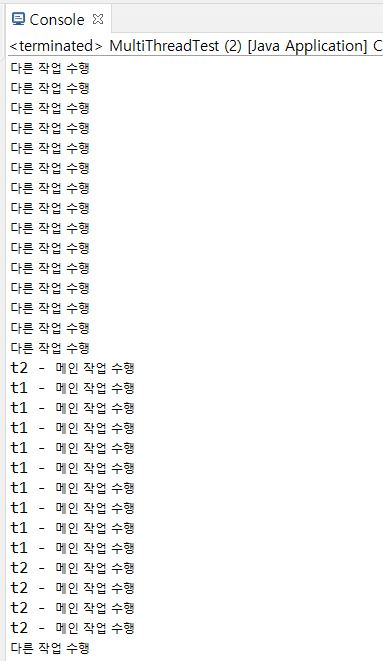

## 실습 2

> 마크다운 활용 및 전체 흐름 파악

* Java 폴더를 만들고,
* 여기에 마크다운으로 이전 클래스 수업내용 + 코드를 작성한다.
* 원격저장소 Java 저장소를 만들고 업로드한다.
  * 원격저장소 이름은 변경가능
* 완료 후 실습2.Java에 링크 만들기


### MultiThread Test

* MultiThread를 사용하는 방법 중 하나인 `Runnable`을 `implements` 하여 사용하는 법을 알아보자.

```java
class Multi1 implements Runnable{ // 다른 메소드를 extends 했을 시 Runnable implement
	public void run() { // run 메소드를 반드시 오버라이딩 해야한다.
	for(int i = 1; i <= 50 ; i++) {
		System.out.println
		(Thread.currentThread().getName()+" - 메인 작업 수행"); 
		//getName()만 쓰면 Thread를 상속받고 있지 않기에 사용이 불가능하다.
		}
	}
}

public class MultiThreadTest {

	public static void main(String[] args) {
		Multi1 m1 = new Multi1();
		Thread t1 = new Thread(m1); // implements Runnable 을 할 때 반드시 수행
		
		// 1.Priority + 2. 시간할당 + 3. 멀티코어 -10
		t1.setName("t1"); // 스레드 이름 설정
		t1.setPriority(Thread.MAX_PRIORITY); //스레드 우선순위 설정
	
		Multi1 m2 = new Multi1();
		Thread t2 = new Thread(m2);
		t2.setName("t2");
		t2.setPriority(Thread.MIN_PRIORITY);
		
		t1.start(); //run() 동시실행
		t2.start();
		
		for(int i = 1; i <= 50 ; i++) {
			System.out.println("다른 작업 수행");
		}
	}
}

```

* 다음과 같은 결과가 나타나게 된다.



* 결과는 다를 수 있으나 스레드에 설정된 우선순위에 따라 작업순서가 결정되는 것을 알 수 있다.